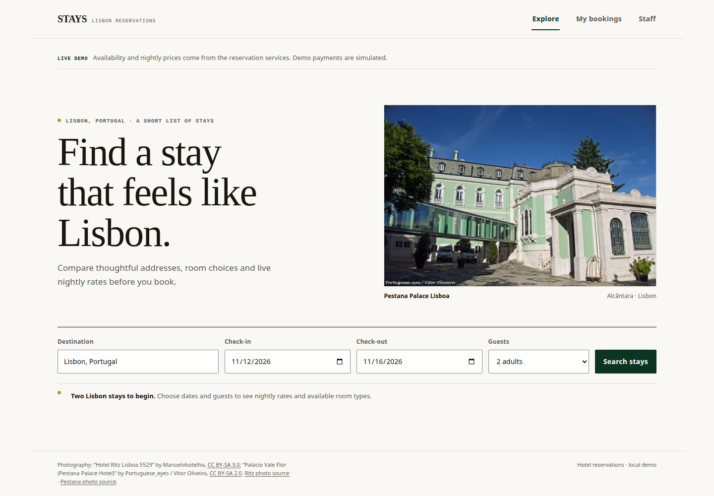

# Stays · Lisbon Hotel Reservations

A Java and React hotel reservation demo forked from [hotel-dry-kiss-yagni](https://github.com/marcelomiyake/hotel-dry-kiss-yagni). The backend and frontend are organized around domain rules, application use cases, ports, and adapters, while the existing visual system and HTTP API contracts are retained.



## Product behavior

- Search Lisbon hotels by destination, dates, and guest count; compare availability and daily rates.
- Reserve by room type. PostgreSQL stores daily inventory, supports up to 10% overbooking, and uses version-checked updates for concurrent bookings.
- Replay a reservation with its UUID as an idempotency key. Reusing that key with changed details returns a conflict.
- Read reservation history by email and cancel a confirmed reservation. Cancellation releases inventory and records a simulated refund.
- Let staff edit room types, capacity, inventory, and nightly rates behind the admin key.

The seeded catalog contains two Lisbon hotels. Payments are simulated; the demo does not collect card details or contact a hotel.

## Architecture

The backend is split into five Spring Boot services: hotel catalog, rates, payments, reservations, and shared API concerns. Each business service uses the same dependency direction:

| Layer | Responsibility |
| --- | --- |
| `domain` | Business concepts and invariants such as hotel, reservation, payment status, and rate period |
| `application/command` | State-changing use cases and command handlers |
| `application/query` | Read use cases and query handlers |
| `application/port` | Interfaces for persistence and calls to other services |
| `adapter/in/web` | HTTP controllers and API mapping |
| `adapter/out/jdbc` | Database implementations of persistence ports |
| `adapter/out/http` | Reservation service clients for catalog, rates, and payments |

Commands and queries have separate application interfaces and handlers. Domain objects enforce their own valid state. Application code depends on ports; JDBC, HTTP, and Spring MVC remain adapters around those use cases. This keeps business rules testable without changing the public routes, request headers, or JSON response fields.

The React app follows the same direction:

| Frontend area | Responsibility |
| --- | --- |
| `src/domain` | Booking and search validation rules |
| `src/application` | Hotel query and command interfaces |
| `src/infrastructure` | HTTP gateway implementing the application interfaces |
| `src/presentation` | React screens and interaction flow |
| `src/main.tsx` | Composition of the HTTP gateway and presentation |

`frontend/src/styles.css` retains the existing design system. The API-facing gateway continues to call the same `/api` routes and uses the same request and response contracts.

## Run on local Kind

Requirements: Docker, Kind, kubectl, and `openssl`.

```bash
./scripts/kind-up.sh
```

Open [http://localhost:8080](http://localhost:8080). The script creates the `hotel-reservation` cluster, builds and loads local images, and deploys the app. It generates local database and staff keys in `.kind-db-password` and `.kind-admin-key`; those files are ignored by Git.

```bash
./scripts/kind-down.sh
kubectl -n hotel-reservation get deployments,pods,services
```

## HTTP API contracts

| Route | Purpose |
| --- | --- |
| `GET /api/search?destination=Lisbon&checkIn=YYYY-MM-DD&checkOut=YYYY-MM-DD&guests=2` | Search availability and rates |
| `GET /api/hotels?destination=Lisbon` | Read hotel catalog |
| `GET /api/rates/quote?roomTypeId=…&checkIn=…&checkOut=…` | Quote every night in a stay |
| `POST /api/reservations` | Create or replay a reservation |
| `GET /api/reservations?email=…` | Read a guest’s reservation history |
| `DELETE /api/reservations/{id}` | Cancel a reservation and refund the demo payment |
| `POST /api/admin/hotels/{hotelId}/room-types` | Add a room type (`X-Admin-Key`) |
| `PUT /api/admin/room-types/{id}` | Update a room type (`X-Admin-Key`) |
| `PUT /api/admin/inventory` | Update future inventory (`X-Admin-Key`) |
| `PUT /api/admin/rates` | Update one nightly rate (`X-Admin-Key`) |

## Quality checks

Frontend checks:

```bash
cd frontend
npm ci
npm test
npm run build
npm run lint
```

Java integration tests and JaCoCo reports (Docker socket required):

```bash
cd ..
docker run --rm --network=host \
  -v "$PWD":/workspace \
  -v "$HOME/.m2":/root/.m2 \
  -v /var/run/docker.sock:/var/run/docker.sock \
  -w /workspace maven:3.9-eclipse-temurin-25 mvn -B clean verify
```

The verified frontend suite has **15 passing tests** and **92.15% line coverage**. The Java suite has **24 passing tests** and **86.31% aggregate line coverage** across JaCoCo reports.

SonarQube Cloud project: [Hotel Reservation System · DDD Clean Architecture CQRS](https://sonarcloud.io/project/overview?id=marcelomiyake_hotel-dry-kiss-yagni-refactored-ddd-cleanarch-cqrs). The CI-based SonarScanner CLI analysis includes Java, TypeScript, and CSS, imports the JaCoCo and frontend LCOV reports, and currently reports **0 open issues**, **86.6% overall coverage**, and a **passed quality gate**. SonarCloud documents coverage import for CI-based analysis in its [test coverage guide](https://docs.sonarsource.com/sonarqube-cloud/analyzing-source-code/test-coverage/overview).

After generating the frontend and Java coverage reports with the commands above, export `SONAR_TOKEN` and run the scanner from the repository root:

```bash
docker run --rm --network=host \
  -e SONAR_TOKEN -e SONAR_HOST_URL=https://sonarcloud.io \
  -v "$PWD":/usr/src \
  -v "$HOME/.m2/repository":/maven-repository:ro \
  -w /usr/src sonarsource/sonar-scanner-cli:latest \
  '-Dsonar.java.libraries=/maven-repository/**/*.jar' \
  '-Dsonar.java.test.libraries=/maven-repository/**/*.jar'
```

For Lighthouse, build and serve the production frontend with `npm run preview -- --host 0.0.0.0`, then audit `http://localhost:4173/` with the desktop preset. The checked build scored **100** for performance, accessibility, best practices, and SEO; its experimental agentic-browsing readiness checks scored **1.0**. SEO metadata includes the page title and description, Open Graph and Twitter fields, TravelAgency JSON-LD, `robots.txt`, `llms.txt`, and an AI Catalog manifest.

## Analysis record

### Prompt

> This is a fork of https://github.com/marcelomiyake/hotel-dry-kiss-yagni, and now this implementation must follow DDD, Clean Architecture, SOLID, and CQRS in the backend and frontend. Retain the same design system and API contracts. Use SonarQube Cloud via Chrome (https://sonarcloud.io/organizations/marcelomiyake/) to create new SonarQube projects, manage them, and complete this job with zero SonarQube issues and test coverage above 80%. If you need to run the scanner from the command line, I updated ~/.zshrc with the SONAR_TOKEN. Still, you can also use GitHub Actions and push commits in a loop until the issues are clean (the problem is that Rust is not supported for automatic analysis (https://docs.sonarsource.com/sonarqube-cloud/analyzing-source-code/automatic-analysis#supported-languages), so use another approach to consider Rust code in SonarQube Cloud (https://docs.sonarsource.com/sonarqube-server/analyzing-source-code/languages/rust); if you generate another SONAR_KEY, update it in the GitHub project or in .zshrc. The frontend should have a perfect Lighthouse grade and good SEO META in 1 Click. Finally, update the README.md with an analysis that includes this prompt, the harness used here (Codex, GPT-6 Luna with max effort), and the token costs from the sessions to complete this task (input tokens, cache tokens, reasoning tokens, output tokens) and LOC. The cache and sessions were empty just before starting this session. Consult the OpenAI official documentation for token prices to estimate total costs.

### Session and measurements

| Measure | Result |
| --- | --- |
| Harness | Codex · GPT-6 Luna · max effort |
| Frontend tests | 15 passed; 92.15% line coverage |
| Backend tests | 24 passed; 86.31% aggregate Java line coverage |
| SonarQube Cloud | 0 open issues; 86.6% overall coverage; quality gate passed |
| Lighthouse | 100 / 100 / 100 / 100 for performance, accessibility, best practices, and SEO; 1.0 agentic-browsing readiness |
| Production source LOC | 3,614 nonblank lines across 88 Java, TypeScript, TSX, and CSS files |
| Test source LOC | 890 nonblank lines across 15 Java and TypeScript test files |

The LOC count excludes blank lines, generated output, dependencies, assets, documentation, and configuration. The session and cache counters were empty before the task. Token counts are from this Codex thread; cached input is included in input, and reasoning is included in output.

| Token measure | Count |
| --- | ---: |
| Input tokens | 33,029,261 |
| Cached input tokens | 32,269,696 |
| Reasoning tokens (included in output) | 97,854 |
| Output tokens | 162,166 |
| Estimated model-token cost | **$0.48** |

Estimate: `(input − cached input) × $0.10/M + cached input × $0.01/M + output × $0.50/M`, using the official [OpenAI ChatGPT rate card](https://help.openai.com/en/articles/20001415-chatgpt-rate-card-enterprise-token-based-pricing). This is a token-price estimate at the published rates, not an invoice; workspace billing terms may differ.
